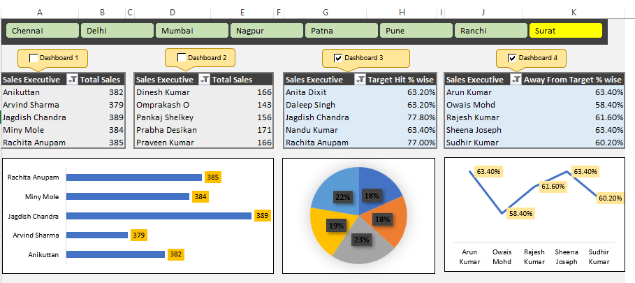

# Sales_Dashboard
An Excel-based sales dashboard for visualizing performance by city and executive.
# 📊 Sales Dashboard using Excel

This project showcases an interactive **Sales Dashboard** built entirely in Microsoft Excel. It helps track and visualize sales performance by **city** and **executive**, using dynamic charts and formulas.

---

## ✅ Features

| Feature         | Description                                 |
|----------------|---------------------------------------------|
| Pivot Tables    | For summarizing sales data                 |
| Excel Charts    | Used for city-wise and executive-wise view |
| Formulas        | SUMIF, IF, % Calculations                  |
| Formatting      | Clean UI & data grouping                   |

---

## 📸 Screenshot

> A preview of the Excel dashboard interface.

---

## 📂 Files Included

| File Name               | Description                                |
|-------------------------|--------------------------------------------|
| Sales_Dashboard.xlsx    | Main Excel file with dashboard & data      |
| Dashboard_Screenshot.png| Preview of the dashboard interface         |

---

## 📌 Tools Used
- Microsoft Excel
- Pivot Tables, Charts, and Conditional Formatting

---

